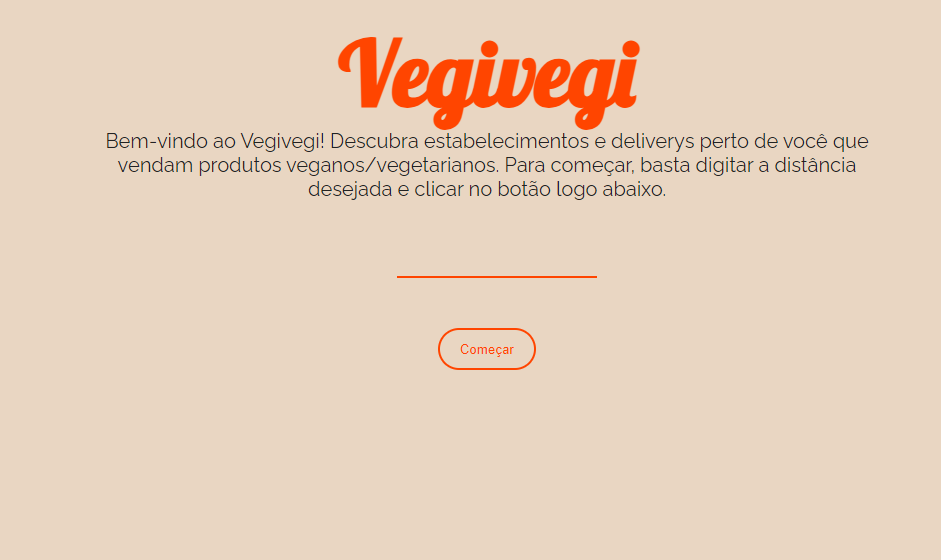

# vegirn
Esse programa consiste em uma aplicação Spring + Angular em que o Javascript pega as coordenadas do navegador do usuário e de acordo com o distância inserida pelo o usuário, será retornado uma lista de locais/estabelecimentos do Rio Grande do Norte que vendem produtos de origem vegana/vegetariana.

<h2>Esse programa utiliza: </h2>
  Java/Spring para o backend 
  Angular pro frontend 
  Postgre para o banco de dados 
  Geolocation API para as coordenadas

<h2>Como iniciar o Angular:</h2> 

Instale todas as depedências: 
npm install 
Execute o project: 
ng s

<h2>Como iniciar o Spring:</h2>
Verifique que você tenha o Java instalado em sua maquina, depois: 
mvn spring-boot:run 
 

 

